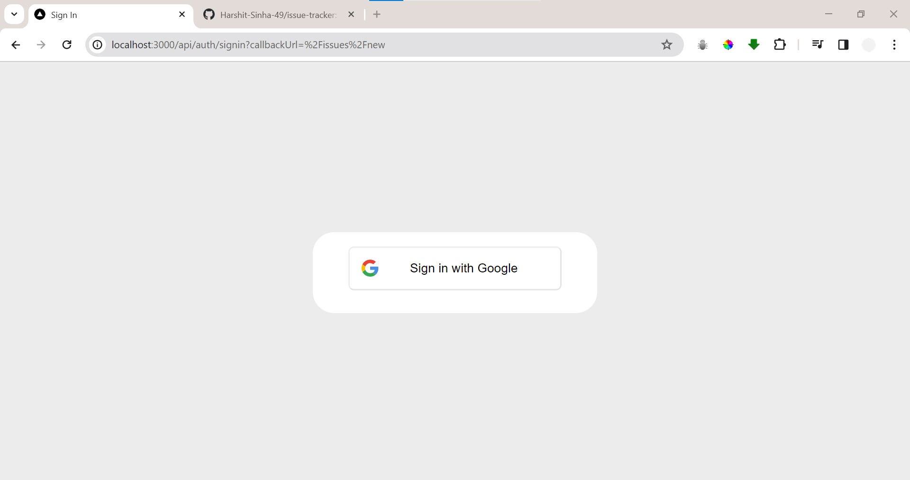

# Issue Tracker Application

### Description:
The Issue Tracker Application is a web-based tool built using Nextjs and TypeScript for the backend, React for the frontend, and Tailwind CSS for styling. The application aims to provide a streamlined process for users to submit, track, and manage issues efficiently. Users can authenticate themselves using Google Cloud OAuth, ensuring secure access to the application. The submitted issues are stored in a MySQL database managed by Prisma ORM.

### My Technology Stack
Here are the technologies I used in this project:

<!--  -->

### Features:

- **User Authentication:** Users can securely authenticate using Google Cloud OAuth, ensuring their identity and protecting the application from unauthorized access.

- **Issue Submission:** Authenticated users can submit issues via a user-friendly interface. They can provide detailed descriptions, tags, and priority levels for each issue.

- **Issue Tracking:** The application allows users to track the status of submitted issues. Each issue can be in one of the predefined states: submitted, in-progress, or resolved.

- **State Management:** The frontend interface dynamically updates to reflect the current state of each issue. Users can easily identify which issues are pending, being worked on, or resolved.

- **Database Integration:** Prisma ORM is used to interact with the MySQL database, providing seamless integration and efficient data handling.

- **Responsive UI:** The frontend UI is built using React, ensuring a responsive and intuitive user experience across different devices and screen sizes.

- **Styling with Tailwind CSS:** Tailwind CSS is utilized for styling, enabling rapid development and customization of the user interface.

Overall, the Issue Tracker Application provides a robust solution for teams and organizations to effectively manage and resolve issues, ensuring smooth workflow and enhanced productivity. With its user-friendly interface, secure authentication, and comprehensive features, it serves as an indispensable tool for tracking and resolving issues in various projects and domains.

### Output Images
Here are some Output images of this project:

